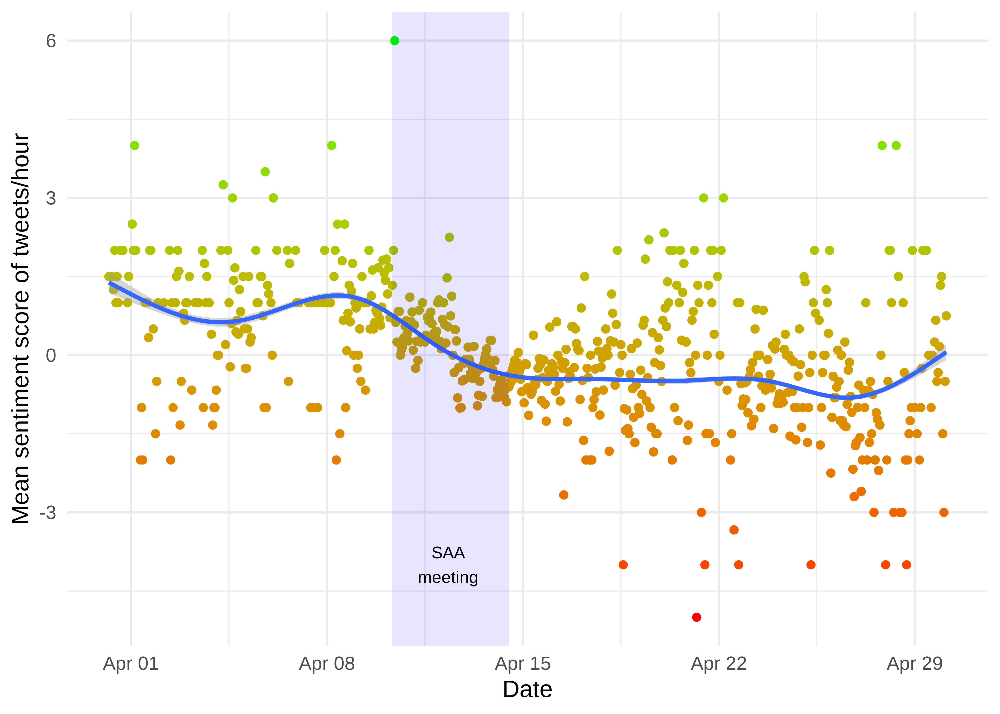
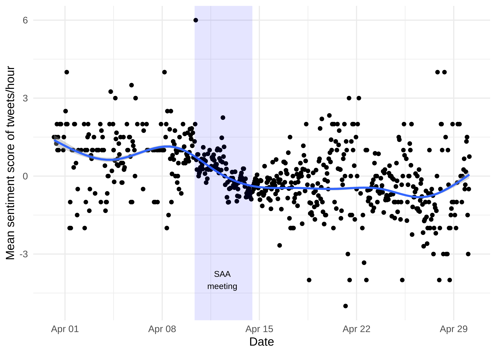

Additional analysis of tweets relating to the 2019 Society of American Archaeology annual meeting
================
Jolene Smith
14 August, 2019

SAA2019 Twitter Analysis
------------------------

The code here builds on code and data from Ben Marwick, available at [OSF](http://doi.org/10.17605/OSF.IO/4CRH8) and [GitHub](https://github.com/benmarwick/saa2019-tweets) with an interactive binder.

Acquire the tweets from the TAGS Google sheet
=============================================

Tweets are extracted and then saved in a CSV for easy reuse. Errors downloading from the TAGS sheet may occur due to Google permissions. My workaround is to create a copy of the original sheet, Publish to Web, and then share with a link.

``` r
library(googlesheets)
library(tidyverse)

tags_sheet <- "https://docs.google.com/spreadsheets/d/17EOoOeGllBxk5x9TS3vEc0zdUwmh_fL0abdEdrOz1Pg/edit#gid=400689247"

saa2019_tweet_archive <- 
tags_sheet %>% 
  gs_url() %>% 
    gs_read(ws = "Archive")

# save a local copy
write_csv(saa2019_tweet_archive,
          "data/saa2019_tweet_archive.csv")

# get the word senitment data
afinn <- read_tsv("https://raw.githubusercontent.com/fnielsen/afinn/master/afinn/data/AFINN-en-165.txt", col_names = c("word", "sentiment"))
afinn <- afinn %>% 
  mutate(sentiment = ifelse(sentiment > 0, "positive",  "negative"))

# save a local copy
write_csv(afinn,
          "data/afinn.csv")
```

Mean sentiment of tweets by hour
--------------------------------

### From Ben Marwick:

> Sentiment analysis of tweets containing the \#saa2019 hashtag posted during March-April 2019. The sentiment of a word in a tweet is computed by looking it up in the AFINN lexicon, which is a list of words that have been tagged by Nielsen et al. with a sentiment score (positive or negative). There are many similar lists, and all have limitations ([1](https://hoyeolkim.wordpress.com/2018/02/25/the-limits-of-the-bing-afinn-and-nrc-lexicons-with-the-tidytext-package-in-r/)). I chose this one because it is optimised for social media text and contains words that are found on twitter but rarely in other contexts. More details about this list have been published here:

> > Finn Årup Nielsen A new ANEW: Evaluation of a word list for sentiment analysis in microblogs. Proceedings of the ESWC2011 Workshop on 'Making Sense of Microposts': Big things come in small packages 718 in CEUR Workshop Proceedings 93-98. 2011 May. <http://arxiv.org/abs/1103.2903>.

Using the Afinn lexicon, words in each tweet are classified as positive or negative. Average counts of negative or positive words per tweet generates a score roughly between -5 and 5. The plot shows the mean score per hour of tweet sentiment.

This plot limits observations to the month of April, leading up to and immediately after the close of the conference.

``` r
library(tidytext)
library(textdata)
library(lubridate)
library(tidyverse)

saa2019_tweet_archive <- 
read_csv("data/saa2019_tweet_archive.csv")
```

    ## Parsed with column specification:
    ## cols(
    ##   id_str = col_double(),
    ##   from_user = col_character(),
    ##   text = col_character(),
    ##   created_at = col_character(),
    ##   time = col_character(),
    ##   geo_coordinates = col_character(),
    ##   user_lang = col_character(),
    ##   in_reply_to_user_id_str = col_double(),
    ##   in_reply_to_screen_name = col_character(),
    ##   from_user_id_str = col_double(),
    ##   in_reply_to_status_id_str = col_double(),
    ##   source = col_character(),
    ##   profile_image_url = col_character(),
    ##   user_followers_count = col_double(),
    ##   user_friends_count = col_double(),
    ##   user_location = col_character(),
    ##   status_url = col_character(),
    ##   entities_str = col_character()
    ## )

``` r
afinn <- read_csv("data/afinn.csv")
```

    ## Parsed with column specification:
    ## cols(
    ##   word = col_character(),
    ##   sentiment = col_character()
    ## )

``` r
saa2019_tweet_archive_dttm <- 
saa2019_tweet_archive %>% 
  mutate(time_dttm = dmy_hms(time)) %>% 
  group_by(hour = floor_date(time_dttm, "hour")) 


bytweet_saa2019_tweet_archive_dttm_sentiment <- 
saa2019_tweet_archive_dttm %>% 
  ungroup  %>% 
  filter(time_dttm >= "2019-03-31 00:00:00" & time_dttm <= "2019-04-30 00:00:00" ) %>%
  select(text, hour, id_str) %>%
  mutate(text = str_remove(text, "\\brt\\b|\\bRT\\b|\\s?(f|ht)(tp)(s?)(://)([^\\.]*)[\\.|/](\\S*)|https://*")) %>% 
  mutate(text = tm::removeWords(text, c(stop_words$word, "the", "The")))  %>%
  unnest_tokens(word, text) %>% 
   inner_join(afinn %>% 
   filter(sentiment %in% c("positive",  "negative")))
```

    ## Joining, by = "word"

``` r
bytweet_saa2019_tweet_archive_dttm_sentiment_tally <- 
bytweet_saa2019_tweet_archive_dttm_sentiment %>%
  group_by(hour, sentiment, id_str) %>% 
  tally() %>% 
  spread(sentiment, n) %>% 
  mutate(negative = negative * -1) %>%
  mutate_all(~replace(., is.na(.), 0)) %>% 
  mutate(mean_sentiment  = mean(negative + positive) )
```

    ## `mutate_all()` ignored the following grouping variables:
    ## Column `hour`
    ## Use `mutate_at(df, vars(-group_cols()), myoperation)` to silence the message.

``` r
ggplot() +
  geom_point(data = bytweet_saa2019_tweet_archive_dttm_sentiment_tally,
           aes(hour, mean_sentiment, color = mean_sentiment)) +
  geom_smooth(data = bytweet_saa2019_tweet_archive_dttm_sentiment_tally,
           aes(hour, mean_sentiment)) +
  scale_color_continuous(low = "red", 
                         high = "green", 
                         name = "Sentiment score") +
      annotate("rect", 
             xmin = ymd_hms("2019-04-10 08:00:00 UTC"),
             xmax = ymd_hms("2019-04-14 12:00:00 UTC"),
             ymin = -Inf,
             ymax = Inf, 
             alpha = 0.1,  
             fill = "blue") +
  geom_text(aes(label="SAA\nmeeting",
                      x = ymd_hms("2019-04-12 08:00:00 UTC"),
                      y = -4), size=3) +
  labs(y = "Mean sentiment of tweets/hour",
       x = "Date") +
       theme_minimal(base_size = 12) 
```

    ## `geom_smooth()` using method = 'gam' and formula 'y ~ s(x, bs = "cs")'



Without dates constrained, there is some noise introduced by use of the \#SAA2019 hashtag by other events, but the trend is still visible.

``` r
bytweet_saa2019_tweet_archive_dttm_sentiment <- 
saa2019_tweet_archive_dttm %>% 
  ungroup  %>% 
  #filter(time_dttm >= "2019-03-31 00:00:00" & time_dttm <= "2019-04-30 00:00:00" ) %>%
  select(text, hour, id_str) %>%
  mutate(text = str_remove(text, "\\brt\\b|\\bRT\\b|\\s?(f|ht)(tp)(s?)(://)([^\\.]*)[\\.|/](\\S*)|https://*")) %>% 
  mutate(text = tm::removeWords(text, c(stop_words$word, "the", "The")))  %>%
  unnest_tokens(word, text) %>% 
   inner_join(afinn %>% 
   filter(sentiment %in% c("positive",  "negative")))
```

    ## Joining, by = "word"

``` r
bytweet_saa2019_tweet_archive_dttm_sentiment_tally <- 
bytweet_saa2019_tweet_archive_dttm_sentiment %>%
  group_by(hour, sentiment, id_str) %>% 
  tally() %>% 
  spread(sentiment, n) %>% 
  mutate(negative = negative * -1) %>%
  mutate_all(~replace(., is.na(.), 0)) %>% 
  mutate(mean_sentiment  = mean(negative + positive) )
```

    ## `mutate_all()` ignored the following grouping variables:
    ## Column `hour`
    ## Use `mutate_at(df, vars(-group_cols()), myoperation)` to silence the message.

``` r
ggplot() +
  geom_point(data = bytweet_saa2019_tweet_archive_dttm_sentiment_tally,
           aes(hour, mean_sentiment, color = mean_sentiment)) +
  geom_smooth(data = bytweet_saa2019_tweet_archive_dttm_sentiment_tally,
           aes(hour, mean_sentiment)) +
  scale_color_continuous(low = "red", 
                         high = "green", 
                         name = "Sentiment score") +
      annotate("rect", 
             xmin = ymd_hms("2019-04-10 08:00:00 UTC"),
             xmax = ymd_hms("2019-04-14 12:00:00 UTC"),
             ymin = -Inf,
             ymax = Inf, 
             alpha = 0.1,  
             fill = "blue") +
  geom_text(aes(label="SAA\nmeeting",
                      x = ymd_hms("2019-04-12 08:00:00 UTC"),
                      y = -4), size=3) +
  labs(y = "Mean sentiment of tweets/hour",
       x = "Month") +
       theme_minimal(base_size = 12) 
```

    ## `geom_smooth()` using method = 'gam' and formula 'y ~ s(x, bs = "cs")'


